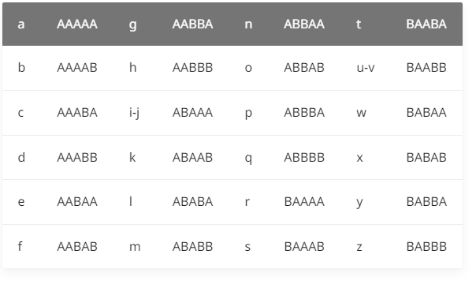

## 培根密码

培根密码使用两种不同的字体，代表A和B，结合加密表进行加解密



可以看到，培根密码主要有以下特点

* 只有两种字符
* 每一段的长度为5
* 加密内容会有特殊的字体之分，亦或者大小写之分

## 栅栏密码

栅栏密码把要加密的明文分成N个一组，然后把每组的第1个字连起来，形成一段无规律的话

## 曲路密码

曲路密码是一种换位密码，需要事先双方约定密钥（也就是曲路路径）。

## 列移位加密

列移位加密是一种比较简单，易于实现的换位密码，通过一个简单的规则将明文打乱混合成密文。

## 0128密码

该密码又称为云影密码，使用0、 1 、 2 、4 、8四个数字，其中0用来表示间隔，其他数字以加法可以表示出

如：28=10

## JSFuck

Jsfuck可以只用6个字符[]()!+来编写JavaScript程序

```javascript
false       =>  ![]
true        =>  !![]
undefined   =>  [][[]]
NaN         =>  +[![]]
0           =>  +[]
1           =>  +!+[]
2           =>  !+[]+!+[]
10          =>  [+!+[]]+[+[]]
Array       =>  []
Number      =>  +[]
String      =>  []+[]
Boolean     =>  ![]
Function    =>  []["filter"]
eval        =>  []["filter"]["constructor"]( CODE )()
window      =>  []["filter"]["constructor"]("return this")()
```

## BrainFuck

!!!

## 猪圈密码

猪圈密码是一种以格子为基础的简单替代式密码

## 舞动的小人密码

出自福尔摩斯探案集

## 键盘密码

### 手机键盘密码

每个数字键上有3-4个字母，用两位数来表示字母，用两位数来表示字母

## 电脑键盘棋盘

利用了电脑的棋盘方阵

## 键盘布局加密

